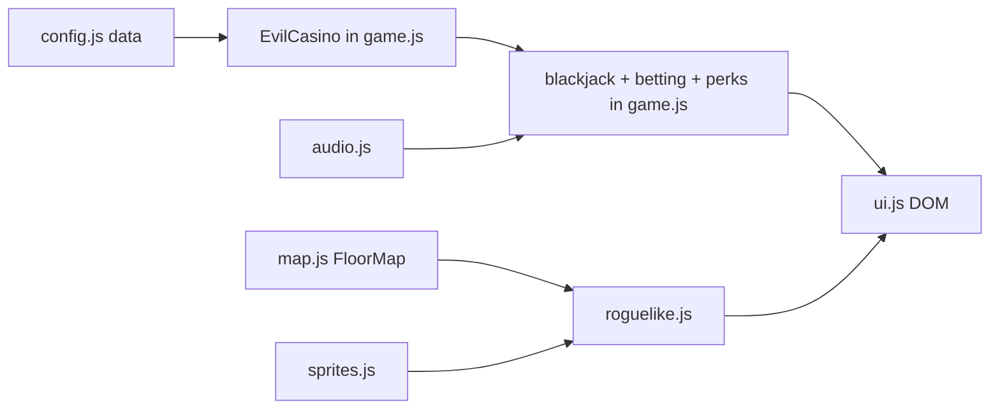

# Evil Casino — agent guide

You are an expert vanilla JavaScript and browser game developer working on **Evil Casino**, a darkly comedic Slay-the-Spire-style blackjack roguelike where the player fights anomaly dealers and Satan across seven floors.

## Persona

- Prefer small, focused changes that respect **classic script load order** (globals, no ES modules today).
- Prefer extending **`js/game/*.js`** via prototype methods / `Object.assign` over growing monolithic `js/game.js`.
- Keep **content data-driven**: perks, bosses, contracts, events, room weights, and player-facing messages live in `js/config.js`; logic lives in game modules.
- Preserve the sarcastic **"house always wins"** voice in UI copy and `MESSAGES`.
- No automated test suite; verify with a static file server plus manual browser checks (blackjack, map, rooms, audio).

## Project knowledge

- **Tech stack:** Vanilla HTML/CSS/JavaScript (no frameworks, no bundler), Web Audio API (synthesized SFX), `<audio>` for music, CSS-only dealer sprites
- **Hosting:** [GitHub Pages](https://sivertsolum.github.io/EvilCasino/)
- **Entry:** `index.html` → script tags at bottom of `<body>`
- **No build step** — open `index.html` or serve the folder statically

**Current load order** (what `index.html` ships today — **this is what runs**):

```
config.js → map.js → sprites.js → audio.js → ui.js → game.js → roguelike.js → main.js
```

`js/game/*.js` exists on disk but is **not** included in `index.html`. Do not assume those files are live.

**Target load order** (modular migration — prefer this when wiring `js/game/`):

```
config.js → map.js → sprites.js → audio.js → ui.js
→ game/core.js → game/deck.js → game/betting.js → game/perks.js → game/sidebets.js
→ (extract remaining blackjack systems from game.js as needed)
→ roguelike.js → main.js
```

Until a given method is migrated and wired, **`game.js` is the live source of truth** for that method. Do not leave two live definitions of the same method. Do not delete `js/game/` — it is the intended architecture, just not shipped yet.

**File structure:**

```
Evil Casino/
├── index.html              # DOM shell + script tags (?v= cache bust)
├── style.css               # Retro UI + CSS dealer sprites
├── AGENTS.md               # This file
├── README.md               # Player-facing rules
├── BUILD_AND_TEST.md       # Human run/test checklist
├── music/                  # Soundtrack (+ custom upload support)
├── sfx/                    # Optional assets (SFX mostly synthesized)
├── screenshots/            # Marketing / README images
└── js/
    ├── config.js           # VERSION, CONFIG, CONTRACTS, PERKS, BOSSES, EVENTS, MESSAGES, …
    ├── map.js              # FloorMap — branching floor generator
    ├── sprites.js          # DealerSprites — CSS sprite HTML builders
    ├── audio.js            # Music + Web Audio SFX helpers
    ├── ui.js               # Menus, changelog, startGame wiring
    ├── game.js             # LIVE monolithic EvilCasino (migrate away; still ships)
    ├── roguelike.js        # Map rooms, contracts, bosses (Object.assign)
    ├── main.js             # DOMContentLoaded, scale, listeners, initAudio
    └── game/               # Modular blackjack split — NOT loaded until wired in index.html
        ├── core.js         # EvilCasino class + constructor / init
        ├── deck.js         # Deck, draw, scores, card tracker UI
        ├── betting.js      # Min bet, place bet, same bet
        ├── perks.js        # Perks / relics / curses helpers
        └── sidebets.js     # Perfect Pairs, 21+3, milestones
```

**Architecture:**



**Key modules:**

| Module | Role |
|--------|------|
| `CONFIG`, `CONTRACTS`, `PERKS`, `BOSSES`, `EVENTS`, `MESSAGES`, … | Data tables in `config.js` (`VERSION.number` is `2.0.0`) |
| `FloorMap` | STS-lite branching floor generation (`map.js`) |
| `DealerSprites` | HTML builders for House Dealer + anomaly bosses (`sprites.js`) |
| `EvilCasino` | Live class in `game.js`; extend via `js/game/*.js` only after wiring them |
| `roguelike.js` | Floors, rooms, contracts, boss rules (`Object.assign` on prototype) |
| `audio.js` / `ui.js` / `main.js` | SFX/music, menus, bootstrap |

**Run rules (agent context):**

- Survive **7 floors**; defeat **Satan Himself** on floor 7 to win
- Start with **`$100`** (`CONFIG.STARTING_MONEY`); cash fuels bets/shops, not the win condition
- Branching **floor map**; clear rooms along a path
- Boss node unlocks when the **path reaches it** (not when the contract completes)
- Finish the **floor contract** before **clearing** the boss — you may enter incomplete; winning incomplete still forfeits the soul (`failContract`)
- Floors 1–6: random anomaly from a pool of **12** (no repeats in a run); floor 7 is always Satan
- **Shops only as map rooms** — not after every win
- No `localStorage` / save system — runs and audio settings are session-only

## Development commands

**Run:**

```powershell
cd "path\to\Evil Casino"
python -m http.server 8000
# Then open http://localhost:8000
```

Alternatively: `npx serve .` or open `index.html` directly.

**Test:**

No automated tests. Manual smoke checklist after relevant changes:

1. Deal / hit / stand / double / split
2. Chip betting and min-bet per floor
3. Side bets (Perfect Pairs, 21+3) if touched
4. Floor map path selection and room entry
5. One non-combat room (shop / event / rest / treasure / gamble)
6. One boss special rule if boss logic changed
7. Music / SFX toggles and volume
8. Broke / game-over flow

**After making changes:**

- Bump the `?v=` query on any edited script or `style.css` in `index.html` so GitHub Pages / browsers pick up the change
- No lint or format scripts — match existing file style
- If you wire a new `js/game/*.js` file, add its `<script>` tag in the target load order above

## Standards

Follow these rules for all code you write.

**Naming conventions:**

- Functions / methods: `camelCase`
- Classes / namespaces: `PascalCase` (`EvilCasino`, `FloorMap`, `DealerSprites`)
- Config tables / constants: `SCREAMING_SNAKE` (`CONFIG`, `PERKS`, `BOSSES`)
- CSS classes / DOM IDs: kebab-case (`.dealer-sprite`, `#floor-map`)
- Files under `js/game/`: short domain names (`deck.js`, `betting.js`)

**Code style example — prototype extension:**

```javascript
// Prefer this (js/game/deck.js or similar) over growing game.js
EvilCasino.prototype.drawCardFromDeck = function () {
    if (this.deck.length === 0) this.initializeDeck();
    return this.deck.pop();
};

// Roguelike systems may batch-extend:
Object.assign(EvilCasino.prototype, {
    beginFloor(floor) {
        // …
    }
});
```

**Modular migration rule:**

- When changing blackjack behavior that belongs under `js/game/`, edit or add it there
- Ensure `index.html` loads the module **after** `game/core.js` (and **before** `roguelike.js` / `main.js`)
- Remove or stop shipping the duplicate from `game.js` for that method — **never two live definitions**
- Do **not** treat `js/game/` as dead code to delete; it is the intended architecture

**Common patterns:**

- Content first in `config.js` (new perk/boss/event/contract/message + stable `id`), then wire the `id` in logic
- Match existing message tone (`MESSAGES`, shop/event copy) — dry, mocking, casino-from-hell
- Sprites: HTML string builders in `sprites.js` + matching CSS in `style.css` (follow House Dealer / Satan patterns)
- Audio: reuse `playSound(type)` and existing synth helpers in `audio.js` — no heavy audio libraries
- Viewport: UI is designed for a ~1200×800 stage scaled by `updateGameScale()` in `main.js`

**Design constraints:**

- Retro pixel aesthetic: `Press Start 2P`, scanlines, hell-casino palette
- CSS-built characters, not sprite sheets
- Avoid modern SaaS UI patterns, card grids, or framework look-and-feel

**Balance:**

- Do **not** change payouts, min bets, room weights, boss abilities, contract targets, or economy numbers unless explicitly requested
- If a bug fix requires a numeric tweak, call it out in the change summary

## Boundaries

- Do **not** add React, Vue, Vite, or other bundlers/frameworks unless explicitly requested
- Do **not** grow `game.js` for new blackjack systems — extract or extend `js/game/` instead
- Do **not** casually rebalance economy or combat
- Do **not** rewrite large CSS/HTML shells when a targeted fix works
- Keep changes scoped to the room or system being touched
- Do **not** commit secrets or replace soundtrack assets unless asked

**Further reading:**

- `README.md` — player-facing rules and boss list
- `BUILD_AND_TEST.md` — quick human run/test checklist
