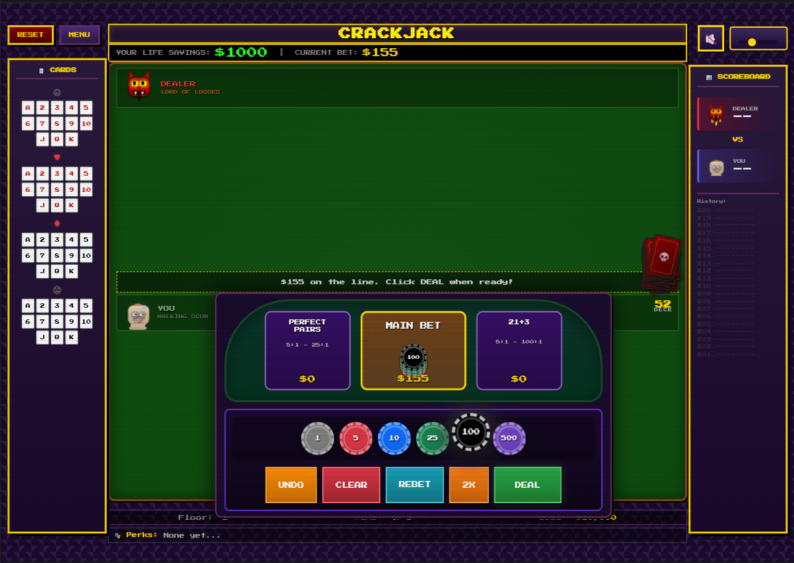
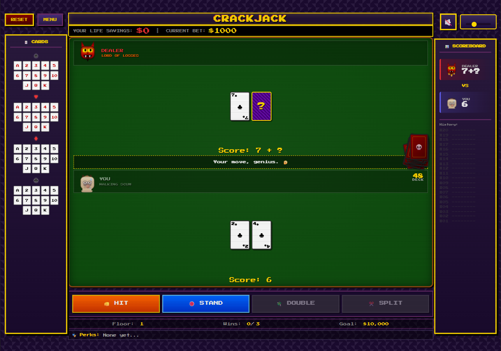
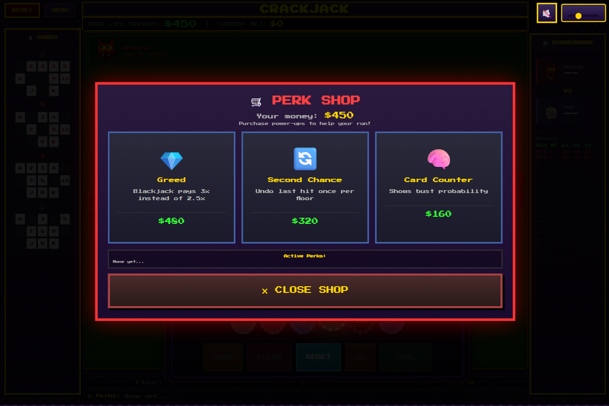
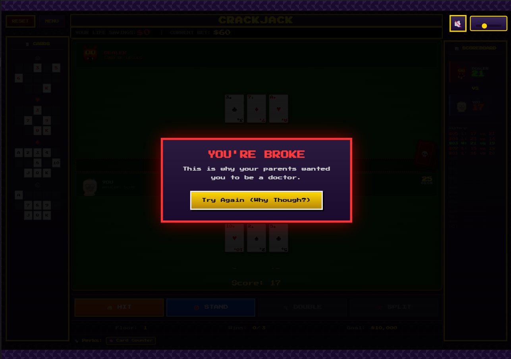

# 🃏 CRACKJACK 🃏

### *"Definitely Not Rigged"™*

A darkly hilarious roguelike blackjack game where you face off against Satan himself in his rigged casino. Battle through 7 floors of increasingly unfair dealers, collect powerful perks and relics, and try to escape with $10,000 — if the house doesn't destroy you first.

---

## [Play Now on GitHub Pages](https://sivertsolum.github.io/Crackjack/)

<!-- 
  ⬆️ UPDATE THIS LINK: Replace YOUR_USERNAME with your GitHub username
  Example: https://johndoe.github.io/crackjack/Crackjack/
-->

> ⚠️ **Warning:** You WILL lose. The house always wins. (But that's part of the fun!)

---

## Screenshots

<p align="center">
  
  
  
  
</p>

*Screenshots coming soon! Add images to the `/screenshots` folder.*

---

## Features

### Roguelike Blackjack
- **7 Floors** of increasing difficulty, each ending with a unique boss
- **Perks & Relics** — Collect powerful upgrades that stack and synergize
- **Curses** — Negative effects that accumulate as you descend deeper
- **Events** — Random encounters with risky choices and rewards
- **Side Bets** — Perfect Pairs and 21+3 for bonus winnings (or losses)

### Unfair Dealers
- **Elite Dealers** — Mini-bosses with special rules like timers, stolen relics, or mirrored hands
- **Floor Bosses** — From THE PIT BOSS to SATAN HIMSELF, each with unique game-changing abilities
- **Cheating Encouraged** — The dealer may or may not cheat. Probably will.

### Shops & Upgrades
- **Perk Shop** — Buy power-ups between hands
- **Rest Sites** — Heal up, meditate, or gamble your winnings
- **Treasure Rooms** — Risk it for rare loot (or a mimic!)

### Retro Aesthetic
- **Pixel Art Style** — CRT scanlines, retro fonts, and nostalgic vibes
- **CSS-Only Characters** — Satan and your pathetic player avatar, rendered in pure CSS
- **Synthesized Sound Effects** — Web Audio API-generated SFX
- **Custom Music Support** — Upload your own soundtrack

---

## How To Play

| Action | Description |
|--------|-------------|
| **Goal** | Escape with $10,000! |
| **Hit** | Take another card (probably a bad idea) |
| **Stand** | Keep your hand (also probably bad) |
| **Double** | Double your bet, take one card, then stand (lmao) |
| **Split** | Split pairs into two hands (risky) |

### Card Values
- **Number cards** = Face value
- **Face cards (J, Q, K)** = 10
- **Aces** = 1 or 11

### Progression
- Win **3 hands** → Choose a perk upgrade
- Beat the **floor boss** → Advance to the next floor
- Reach **$10,000** → You escape! (Good luck with that)

---

## 🏆 Perks & Relics

### Sample Perks
| Perk | Effect |
|------|--------|
| 👁️ X-Ray Vision | See dealer's hidden card once per floor |
| 🍀 Lucky 7s | 7s count as 8 for you |
| 💰 Insurance Fraud | 30% chance to get bet back on loss |
| 🧠 Card Counter | Shows bust probability |
| 🔄 Second Chance | Undo last hit once per floor |
| 🛡️ Soul Shield | Survive one bust per floor |
| ⚡ Quick Draw | First hit each hand can't bust you |

### Sample Relics
| Relic | Effect |
|-------|--------|
| 🪙 Lucky Chip | Start each floor with +$100 |
| 🎲 Devil's Dice | 10% chance for double payout |
| 🃏 Ace in the Hole | Start with an ace once per floor |
| 🧲 Golden Horseshoe | Pushes become wins |
| 🔥 Phoenix Feather | Revive at $500 if broke (once per run) |

---

## 👹 Bosses

| Floor | Boss | Special Rule |
|-------|------|--------------|
| 1 | 👔 THE PIT BOSS | Dealer stands on 18+ |
| 2 | 🎭 LADY LUCK | All cards face-down until stand |
| 3 | 🦈 THE LOAN SHARK | Win = 2.5x, Lose = 2x loss |
| 4 | 🧛 THE COUNTESS | Lose $75 every time you hit |
| 5 | 👯 THE TWINS | Must beat TWO dealer hands |
| 6 | 🎩 THE GRANDMASTER | Dealer always hits soft 17 |
| 7 | 👹 SATAN HIMSELF | Dealer starts with 3 cards |

---

## Audio

- **Background Music** — Ambient casino soundtrack included
- **Custom Music** — Upload your own MP3/OGG/WAV files in Options
- **Sound Effects** — Procedurally generated using Web Audio API

---

## Tech Stack

- **Pure HTML/CSS/JavaScript** — No frameworks, no dependencies
- **CSS Animations** — Flames, scanlines, and character expressions
- **Web Audio API** — Synthesized sound effects
- **LocalStorage** — Progress and settings persistence

---

## Local Development

1. Clone the repository:
   ```bash
   git clone https://github.com/YOUR_USERNAME/crackjack.git
   cd crackjack
   ```

2. Open `Crackjack/index.html` directly in your browser, or serve with a local server:
   ```bash
   # Python 3
   cd Crackjack
   python -m http.server 8000
   # Then visit http://localhost:8000
   
   # Or use Node.js
   npx serve Crackjack
   ```

3. The game works best in modern browsers (Chrome, Firefox, Edge)

---


## Game Tips

1. **Card Tracker** — Use the card tracker on the left to count cards (the house hates this)
2. **Side Bets** — High risk, high reward. Perfect for degenerates.
3. **Save Your Perks** — Some perks are floor-limited, use them wisely.
4. **Watch Your Money** — Go broke and Satan claims your soul.
5. **Boss Prep** — Stock up in shops before boss fights.

---

## License

This project is open source. Feel free to fork, modify, and lose all your virtual money. 

---

## Credits

Made out of spite and questionable life choices.

*© 2025 Satan's Casino Inc. — All rights to your soul reserved.*

---

<p align="center">
  <b>Remember: The house always wins.</b><br>
  <i>(But maybe, just maybe, you'll get lucky...)</i>
</p>

